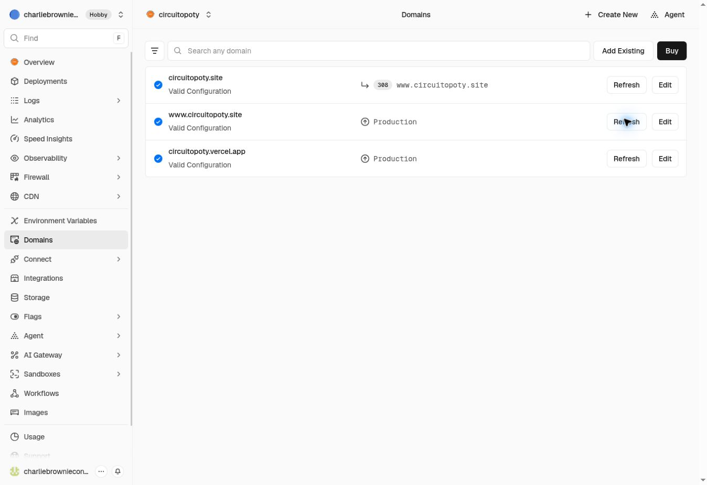

# Migração do Circuito Poty — 6 de outubro de 2026

## Infraestrutura

- GitHub: `charliebrowniecontato-ship-it/Circuito-Poty`.
- Projeto criado pelo proprietário durante a execução: `circuitopoty`, na equipe `charliebrowniecontato-7772`.
- Branch de produção: `main`; branch de validação: `migration-preview`.
- Preview automático validado: https://circuitopoty-77dv8e7x2-charliebrowniecontato-7772.vercel.app/.
- Domínios verificados na Vercel: `www.circuitopoty.site` e `circuitopoty.site`. O domínio sem www redireciona com HTTP 308 para o domínio com www.
- O projeto anterior `circuito-poty` não foi excluído, recriado ou renomeado.

## Preservação

`index.html`, `styles.css`, `app.js`, `robots.txt` e `sitemap.xml` foram recuperados diretamente do site em produção. Após reverter apenas as substituições de URLs dos assets e a correção do MIME da OG Image, o conteúdo desses cinco arquivos corresponde exatamente à origem.

Doze imagens/logos do Poty foram baixados sem edição ou recompressão. SHA-256, tamanho, dimensões e URL de origem estão em `asset-manifest.json`. Nenhum asset do Poty depende mais do Google Drive ou Imgur. A fonte Nunito e a logo da Rede Reaver continuam em suas origens oficiais.

A OG Image mantém a mesma imagem e passa a usar `https://www.circuitopoty.site/assets/images/lancamento-circuito-poty.png`, com MIME `image/png`. Metatags OG/Twitter, canonical, textos, sitemap, robots, layout, animações e comportamento foram preservados.

## Validação

- UTF-8 sem BOM; nenhum dos padrões de mojibake indicados no briefing.
- CSS idêntico à produção; JavaScript com sintaxe válida e somente URLs de assets alteradas.
- Checkout do GitHub conferido byte a byte contra os 18 arquivos de código/assets enviados.
- Desktop 1440×1000; celulares 390×844 e 360×800.
- Imagens, fonte Nunito, três abas de impacto, popup e fechamento com Escape.
- Carrossel manual e automático, preenchimento dos títulos e animação do 30%.
- Sem overflow horizontal nem erros de JavaScript ou respostas HTTP com falha nos testes locais.
- Capturas comparativas de origem/migração iguais nos três viewports, com a mesma estratégia de carregamento e renderização.
- Links internos, Instagram, WhatsApp e Legacy preservados; nenhuma mensagem foi enviada.
- Cinco arquivos principais publicados em `circuitopoty.vercel.app` conferidos com HTTP 200 e bytes idênticos aos arquivos do repositório.
- Preview remoto da Vercel validado no navegador: abas de impacto e popup com imagens locais carregadas; nenhum erro do site identificado. Avisos da extensão de automação foram desconsiderados.
- Atualização na branch `migration-preview` gerou automaticamente um deploy READY, confirmando a integração Git.

As plataformas sociais podem manter caches próprios da prévia de compartilhamento. A migração valida o arquivo de imagem e as metatags, sem afirmar atualização imediata desses caches.

## Refinamento posterior autorizado pelo proprietário

- `robots.txt` mantém conteúdo e assets públicos liberados.
- `sitemap.xml` usa a URL canônica, data real da atualização e as dez imagens de conteúdo.
- `llms.txt` oferece contexto conciso e aponta para a versão Markdown da apresentação em `index.md`.
- JSON-LD Organization, WebSite e WebPage com dados presentes no site; Twitter image alt e diretrizes de prévia adicionados.
- HTML visível e CSS original preservados; comparações em 1440, 390 e 360 pixels mantiveram aparência equivalente.
- Popup com descrição acessível, foco contido, retorno ao card e conteúdo de fundo inerte; abas operáveis por teclado.
- Carrossel respeita movimento reduzido, pausa no popup e suspende o temporizador quando a página está oculta. Os tempos normais de animação foram preservados.
- Testes específicos passaram com e sem movimento reduzido; o carrossel não avança atrás do popup.
- Headers servem Markdown como UTF-8 e evitam indexação de cópias e arquivos operacionais.

